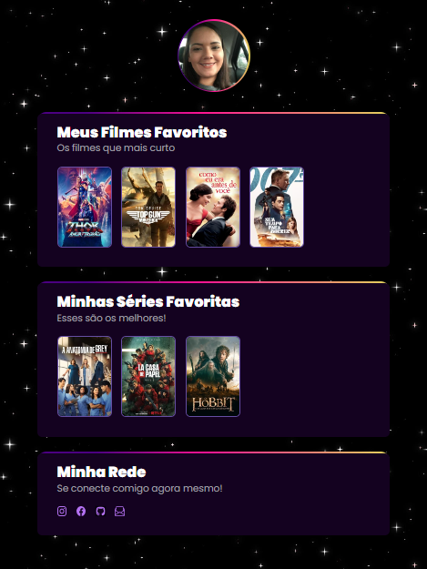

# Desafio NLW

> Projeto construido após o evento NLW da Rocketseat, como desafio criei um site com meus filmes e séries favoritos, seguindo a mesma linha que o projeto em si. Utilizei um modelo no Figma para colher as informações de tamanhos, e apliquei as minhas configurações de fundo e cores. A animação foi feita pelo proprio CSS.

🔗 [Clique aqui para ver o projeto](https://karenveras.github.io/Desafio-explorer/)

## 🛠 Tecnologias

- HTML
- CSS
- Git e Github

## 💌 Contato

karen.abelini@gmail.com